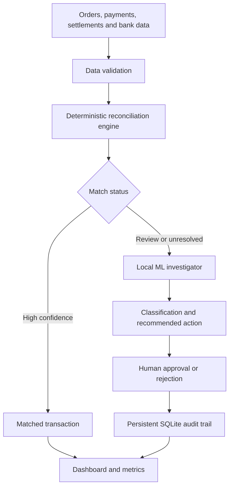
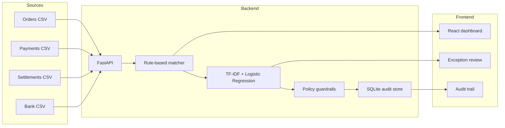

# ReconcileAI

An explainable AI Finance Controller that reconciles payments, settlements and bank credits, investigates financial exceptions, requires human approval and records every reviewer decision in an audit trail.

Built for the **Razorpay AI Buildathon — AI Finance Controller Track**.

## Problem

Finance teams frequently compare information from multiple disconnected sources:

- Customer orders
- Payment-gateway transactions
- Gateway settlements
- Bank credits

Manual reconciliation is slow and error-prone. Missing settlements, incorrect fees, duplicate payments and unmatched bank credits can remain unnoticed.

ReconcileAI automates the reconciliation workflow while keeping financial decisions explainable, bounded and human-controlled.

## Product workflow



## Key features

- Reconciles more than 50 financial records in one batch
- Processes 100 labelled payment cases
- Matches payments, settlements and bank credits
- Detects missing settlements and bank credits
- Detects gateway-fee and amount mismatches
- Detects duplicate transactions
- Produces confidence scores and explanations
- Uses a local machine-learning model for exception classification
- Requires human approval for every AI recommendation
- Prevents automatic modification of source financial records
- Stores reviewer decisions in a persistent audit trail
- Reports precision, recall, F1 score and unresolved cases
- Runs without external AI APIs or secret keys

## Architecture



## Technology stack

### Backend

- Python
- FastAPI
- Pandas
- Scikit-learn
- RapidFuzz
- Pydantic
- SQLite
- Joblib
- Pytest

### Frontend

- React
- Vite
- JavaScript
- CSS
- Fetch API

### Development

- Git
- GitHub
- VS Code
- Swagger/OpenAPI

## Reconciliation engine

The deterministic engine handles financial facts that should not be delegated to a language model:

- Exact payment-to-settlement matching
- Fee calculation
- Net-amount comparison
- Date-window validation
- Duplicate detection
- Refunded-payment exclusion
- Settlement-to-bank-credit matching
- Reference similarity

Uncertain records are marked as `review` or `unresolved` instead of being silently matched.

## Local ML investigator

ReconcileAI uses a supervised text-classification pipeline:

1. Convert exception descriptions into TF-IDF features.
2. Train a Logistic Regression classifier.
3. Predict the exception category.
4. Return a probability-based confidence score.
5. Map the classification to a bounded recommended action.
6. Require human approval before recording the recommendation.

### Supported classifications

- `missing_settlement`
- `missing_bank_credit`
- `fee_mismatch`
- `amount_mismatch`
- `duplicate`
- `reference_mismatch`
- `unknown`

### Safety threshold

Predictions below 60% confidence are converted to `unknown` and require manual investigation.

## Evaluation results

### Reconciliation evaluation

The reconciliation engine was evaluated against labelled ground truth containing 100 synthetic payment cases.

| Metric | Result |
|---|---:|
| Labelled cases | 100 |
| True positives | 85 |
| False positives | 0 |
| False negatives | 3 |
| Precision | 100% |
| Recall | 96.59% |
| F1 score | 98.27% |
| Automatically matched | 85 |
| Human-review cases | 7 |
| Unresolved cases | 5 |
| Refunded exclusions | 3 |

The system prioritizes avoiding false-positive financial matches. Some valid matches are deliberately sent for review when confidence is insufficient.

### Local ML evaluation

| Metric | Result |
|---|---:|
| Training examples | 525 |
| Held-out test examples | 175 |
| Held-out accuracy | 100% |

The classifier was evaluated on held-out synthetic examples generated from the same controlled problem distribution as the training data. This result verifies reproducibility within the prototype dataset; it must not be interpreted as expected accuracy on unseen production banking data.

Detailed metrics and the confusion matrix are available in:

```text
evaluation/local_ai_metrics.json
```

## Financial guardrails

ReconcileAI applies the following safety rules:

- AI recommendations cannot modify source financial data.
- Every AI recommendation requires human approval.
- Low-confidence predictions are classified as unknown.
- Exact amount and fee calculations remain deterministic.
- Reviewer decisions are stored with timestamps and evidence.
- Missing information is surfaced rather than invented.
- No payment, refund or money transfer is executed.
- Audit records preserve the model classification and confidence used at decision time.

## Human-review workflow

For a record marked `review` or `unresolved`, the finance reviewer can:

1. Select **Investigate**.
2. View the ML classification and confidence.
3. Review the evidence and recommended action.
4. Add a reviewer note.
5. Approve or reject the recommendation.
6. View the decision in the audit trail.

The original financial record remains unchanged.

## Synthetic dataset

The project contains synthetic data representing:

- 100 orders
- 101 payment rows, including a duplicate
- Payment settlements
- Bank credits
- Labelled reconciliation ground truth

Included exception cases:

- Missing settlement
- Missing bank credit
- Incorrect gateway fee
- Incorrect bank-credit amount
- Duplicate payment
- Refunded payment
- Reference-format difference
- Delayed bank credit
- Unidentified bank credit

The dataset uses a fixed random seed so results can be reproduced.

Generate it with:

```bash
python scripts/generate_data.py
```

## Project structure

```text
ReconcileAI/
├── backend/
│   └── app/
│       ├── agents/
│       │   ├── exception_model.joblib
│       │   └── investigator.py
│       ├── matching/
│       │   └── engine.py
│       ├── audit.py
│       ├── evaluation.py
│       └── main.py
├── data/
│   ├── ground_truth/
│   └── sample/
├── evaluation/
│   ├── local_ai_metrics.json
│   └── results.json
├── frontend/
│   └── src/
│       ├── App.jsx
│       └── App.css
├── scripts/
│   ├── evaluate.py
│   ├── generate_data.py
│   └── train_exception_model.py
├── tests/
├── .env.example
├── .gitignore
├── requirements.txt
└── README.md
```

## Local setup

### Prerequisites

- Python 3.10 or later
- Node.js 18 or later
- npm
- Git

### 1. Clone the repository

```bash
git clone https://github.com/SAIPRANITHA31/ReconcileAI.git
cd ReconcileAI
```

### 2. Create a Python environment

Windows PowerShell:

```powershell
python -m venv .venv
.\.venv\Scripts\Activate.ps1
```

macOS or Linux:

```bash
python -m venv .venv
source .venv/bin/activate
```

### 3. Install backend dependencies

```bash
python -m pip install -r requirements.txt
```

### 4. Generate data and train the local model

```bash
python scripts/generate_data.py
python scripts/train_exception_model.py
python scripts/evaluate.py
```

### 5. Run the tests

```bash
python -m pytest -q
```

### 6. Start the backend

```bash
python -m uvicorn backend.app.main:app --reload
```

Backend:

```text
http://127.0.0.1:8000
```

API documentation:

```text
http://127.0.0.1:8000/docs
```

### 7. Start the frontend

Open another terminal:

```bash
cd frontend
npm install
npm run dev
```

Frontend:

```text
http://localhost:5173
```

## API endpoints

| Method | Endpoint | Purpose |
|---|---|---|
| GET | `/health` | Backend health check |
| GET | `/api/metrics` | Reconciliation evaluation metrics |
| GET | `/api/reconciliation` | Batch reconciliation results |
| GET | `/api/reconciliation/{payment_id}` | One reconciliation record |
| POST | `/api/investigate/{payment_id}` | Run the local ML investigator |
| POST | `/api/review/{payment_id}` | Record human approval or rejection |
| GET | `/api/audit` | Retrieve the persistent audit trail |

## Example investigation

Request:

```text
POST /api/investigate/PAY0009
```

Example result:

```json
{
  "category": "missing_settlement",
  "summary": "A successful payment appears to have no settlement record.",
  "recommended_action": "request_settlement_details",
  "confidence": 0.9143,
  "evidence": [
    "successful payment has no settlement"
  ],
  "requires_human_approval": true
}
```

## What broke and how it was fixed

### 1. External model version became unavailable

An early Gemini integration used a model that was no longer available to new users.

**Fix:** The model configuration was updated rather than hard-coded.

### 2. External AI projects returned permission errors

Gemini and Groq projects returned provider-level `403 permission_denied` errors even though the application integration was valid.

**Fix:** The external dependency was removed. A reproducible local TF-IDF and Logistic Regression pipeline was implemented instead. This eliminated API keys, network dependency and third-party availability risk.

### 3. AI could classify without an execution boundary

A classification alone was not safe enough for a finance workflow.

**Fix:** Human approval was made mandatory. The application records recommendations but never changes source financial records or executes money actions.

### 4. UI initially displayed investigations away from the selected row

The investigation panel appeared above the table, so users could miss the result after selecting a row.

**Fix:** Smooth automatic scrolling was added after the investigation completes.

### 5. Audit history was initially temporary

Reviewer actions would have been lost on restart.

**Fix:** SQLite persistence was added so approvals, rejections, notes and model evidence survive backend restarts.

## Known limitations

- The project uses synthetic data and has not been validated against production Razorpay data.
- The ML dataset is controlled and smaller than a production training dataset.
- The classifier currently analyses normalized exception descriptions rather than full transaction histories.
- Authentication and role-based reviewer access are not included in the prototype.
- The local SQLite audit store is designed for demonstration, not distributed production deployment.
- The frontend currently expects the backend at `127.0.0.1:8000`.
- No financial action is executed automatically.

## Future improvements

- Evaluate using anonymized real-world reconciliation data.
- Add batch CSV upload and schema validation.
- Add reviewer authentication and role-based access.
- Add drift monitoring and confidence calibration.
- Add model-version information to every audit event.
- Support grouped settlements containing multiple payments.
- Add configurable matching tolerances.
- Export audit and exception reports as CSV.
- Deploy the audit store using a production relational database.

## Testing

Run:

```bash
python -m pytest -q
```

The tests verify:

- Reconciliation precision
- False-positive protection
- Exception surfacing
- API health
- Batch response size
- Metrics endpoint
- Unknown-payment handling

## Author

**Sai Pranitha Kummara**

- GitHub: [SAIPRANITHA31](https://github.com/SAIPRANITHA31)
- LinkedIn: [Sai Pranitha](https://www.linkedin.com/in/3101saipranitha/)

## Responsible-use statement

ReconcileAI is a defensive finance-operations prototype. It is not intended to authorize payments, initiate refunds, move funds or replace qualified finance reviewers.